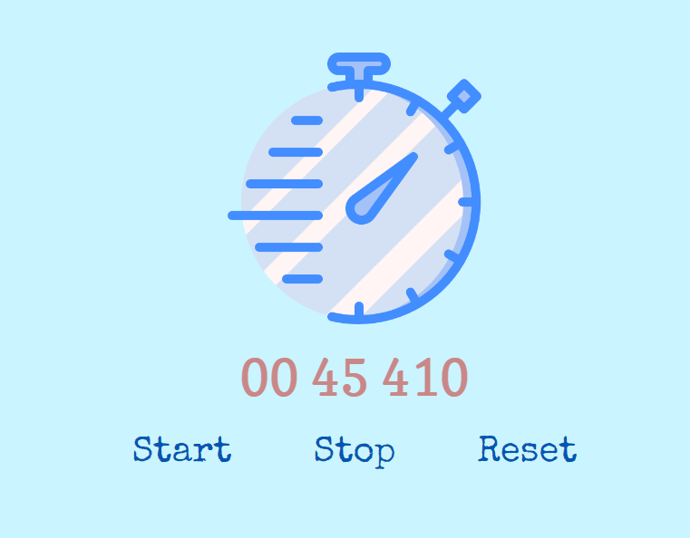

# Image gallery

> A simple

## Table of contents

- [Image gallery](#image-gallery)
  - [Table of contents](#table-of-contents)
  - [General info](#general-info)
  - [Screenshots](#screenshots)
  - [Technologies](#technologies)
  - [Setup](#setup)
  - [Code Examples](#code-examples)
  - [Features](#features)
  - [Status](#status)
  - [Inspiration](#inspiration)
  - [Contact](#contact)

## General info

> The objective of the project is to practice separation of concern in
> JavaScript.

## Screenshots



## Technologies

- JavaScript
- HTML5
- CSS3
- VSC code

## Setup

clone the repo and start using the stop watch.

## Code Examples

```js
export const updateTime = (data) => {
	data.milliseconds += 10;
	if (data.milliseconds === 1000) {
		data.milliseconds = 0;
		data.seconds += 1;
	}

	if (data.seconds === 60) {
		data.seconds = 0;
		data.minutes += 1;
	}

	if (data.minutes === 60) {
		data.minutes = 0;
	}

	return data;
};
```

## Features

List of features ready and Todos for future development

-
-
-

To-do list:

-
-

## Status

Project is: _finished_

## Inspiration

## Contact

- [Emrah](https://github.com/emrahhko)
